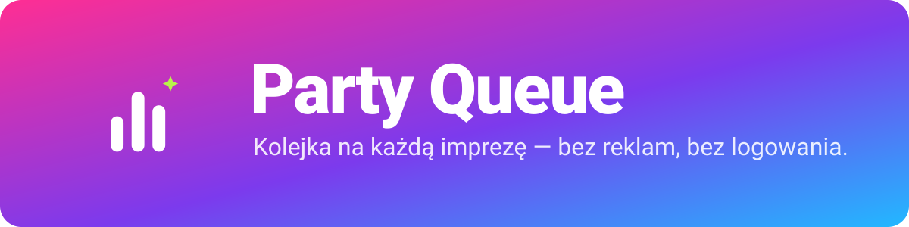

<p align="center"></p>

# Party Queue

Android app (Kotlin + Compose) that turns a phone or tablet into a party jukebox:

- plays YouTube **without ads** in an embedded Firefox engine (GeckoView) with uBlock Origin built in,
- keeps playing with the screen off (foreground service + "Play YouTube Video In Background" add-on),
- loads a **public playlist** into a local queue (no Google login, no API key),
- serves a **guest web page** on the local network; guests open the page (the QR code in the *Zaproś* tab just opens it), propose songs, the host approves,
- a **YouTube tab** to browse YouTube and set a playlist as the current one (or add a single video) with one tap,
- gestures on the queue: swipe right to play now, left to remove, hold and drag to reorder; one tap clears it,
- guests can ask for host rights; a co-host has the same powers as the host (including approving other co-hosts).

The queue is local to the app. Nothing is written back to YouTube.

Requires Android 10 or newer (API 29), arm64. Licence: [AGPL-3.0](LICENSE); bundled components are listed in
[THIRD_PARTY.md](THIRD_PARTY.md). Using it may conflict with YouTube's Terms of Service.

## Build and install

```bash
export JAVA_HOME=/opt/homebrew/opt/openjdk@17/libexec/openjdk.jdk/Contents/Home
export ANDROID_HOME=/opt/homebrew/share/android-commandlinetools
./gradlew assembleDebug
$ANDROID_HOME/platform-tools/adb install -r app/build/outputs/apk/debug/app-debug.apk
```

The first build downloads uBlock Origin and the background-playback add-on (checksum-verified, see
`addons.lock`). GeckoView 157 needs compileSdk 37.1 and AGP 9.x (see `build.gradle.kts`).

## Test

```bash
./gradlew lintDebug testDebugUnitTest      # automatic checks, also run in CI
scripts/smoke-test.sh <phone-ip> [serial]  # end-to-end against a phone running a debug build
```

The full quality process (including the manual checklist for releases) is in [docs/QA.md](docs/QA.md);
how to contribute and cut a release is in [CONTRIBUTING.md](CONTRIBUTING.md). The version is in `version.properties`,
the history in [CHANGELOG.md](CHANGELOG.md).

## How it fits together

| Piece | File |
| --- | --- |
| Queue, proposals, guests, roles, playback logic | `PartyController.kt` |
| Key-less YouTube search / playlist / metadata (reads the public pages) | `YouTubeClient.kt` |
| HTTP + WebSocket server (Ktor CIO, port 8080) | `PartyServer.kt` |
| GeckoView session and add-on messaging | `PlayerBridge.kt`, `assets/extensions/bridge/` |
| Host UI (Compose, respects system bars) | `HostScreen.kt` |
| Guest web page | `assets/guest/index.html` |
| Keeps the process alive (wake lock, Wi-Fi lock, notification) | `PlaybackService.kt` |
| Pure parsing of YouTube's embedded JSON | `YouTubeParser.kt` |

Add-ons are bundled unpacked in `assets/extensions/`. The bridge add-on's version in `manifest.json`
must be bumped whenever its scripts change, otherwise GeckoView keeps the old copy.

## Things worth knowing

- `PartyApp.onCreate` also runs inside every Gecko child process; only the main process may create the runtime.
- Two hidden player pages take turns: while one plays, the other already holds the next song (paused, muted), so a change of
  song is instant. YouTube makes people who block ads wait 5-13 s for a video to start; this hides that wait.
- Autoplay is allowed through the session `PermissionDelegate` (Gecko prefs alone were not enough).
- The mobile YouTube site loads nothing until its play button is pressed; the bridge presses it.
- The bridge rejects the YouTube cookie banner ("reject all") automatically.
- The HTTP server has no TLS: use it on a network you trust. Anyone who opens the page and gives a name is
  a guest (they get a random token); the host can close joining and still approves every proposal.
- Some routers isolate Wi-Fi clients; use the host phone's hotspot in that case.

## Your own playlists

Public and unlisted playlists: paste the link (*YouTube* tab → *Wklej link*) or open it in the *YouTube* tab and press *Ustaw jako aktualną playlistę*.
Playlists keep the order they have on YouTube (shuffling is an explicit switch).
Private playlists: sign in via *Zaloguj się* in the YouTube tab and import from there (experimental). The simplest
workaround is to set the playlist to *Unlisted* on YouTube. The first ~100 videos of a playlist are imported.

## Not done yet

- No lock-screen media controls (MediaSession).
- No write-back to YouTube / private playlists (would need Google sign-in and the Data API).
